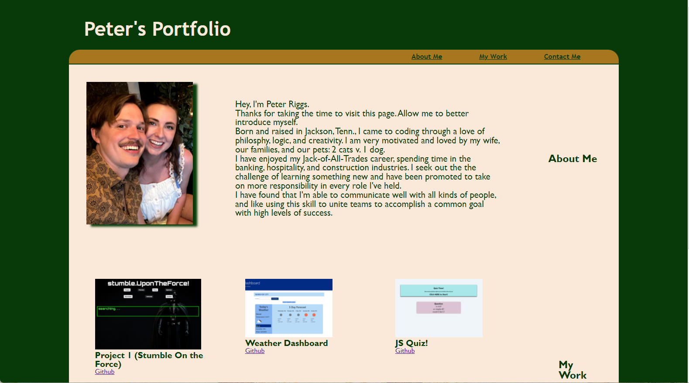

# <Homework-2-Portfolio>

## Description

- Creating a portfolio of work to showcase my skills and talents to potential employers who are looking to fill a part-time or full-time position.
- I want my potential future Employer to be able to review samples of my work and assess the fact that I am a good candidate for their open position. 
- Key items I'm including; my name, photo, and links to sections about me, my work, and how to contact me. Also, I am including images of my applications and links to their locations. 

link https://par92.github.io/HW-2/

screenshot 